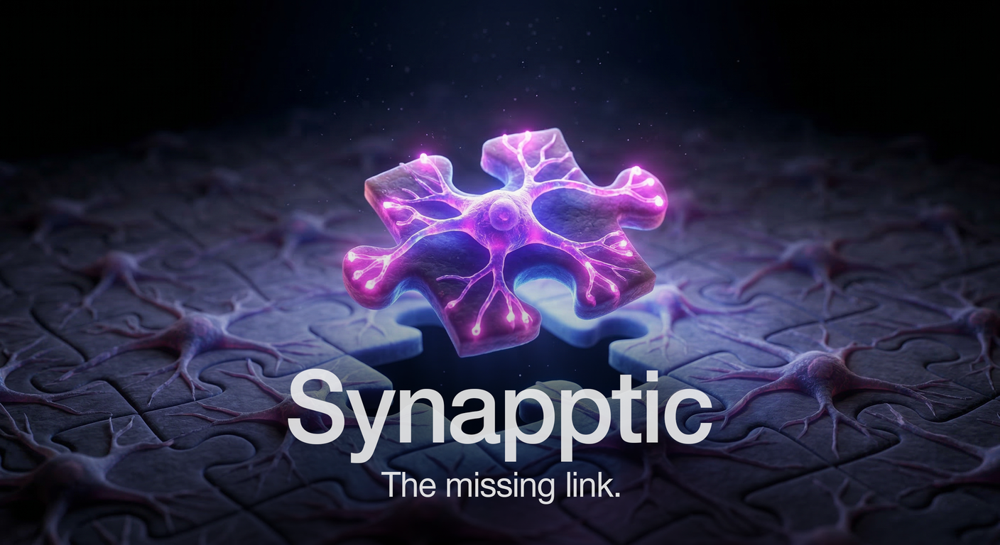

<p align="center">
  
</p>

<p align="center">
  
  
  <a href="https://pypi.org/project/synapptic/"></a>
  <a href="https://github.com/appcuarium/synapptic/actions/workflows/tests.yml"></a>
  
</p>

**synapptic** analyzes your AI coding sessions and builds a living profile that your agent loads at the start of every conversation. Not just your preferences - it detects interaction patterns you didn't even notice: the corrections you keep making, the assumptions your AI gets wrong, the workflow quirks that matter to you but you never thought to write down.

The difference between memory files you write yourself (CLAUDE.md, .cursorrules) and what **synapptic** generates is that you can only document what you're aware of. **synapptic** sees the patterns underneath - the things that cause friction without you realizing why. It watches fifty sessions and tells your AI: "this person interrupts when you over-investigate, stops reading after the second paragraph, and will lose trust if you claim something without checking the code first."

The result is simple: you stop fighting the model. You stop repeating yourself. You get back into flow - the state where you're thinking about your code, not about how to make yourself understood.

Every **synapptic** install is personal. No two profiles are alike because no two developers are alike. Your profile reflects your communication style, your expertise, your frustrations, your standards. It's a fingerprint of how you work - built from your actual sessions, not from a template.

## Get started

```bash
pip install synapptic
synapptic init       # pick your LLM provider and output targets
synapptic install    # set up automatic session processing
synapptic ingest     # analyze your existing sessions
```

That's it. From now on, every session ends with **synapptic** quietly learning in the background. The next session starts smarter.

## What it builds

After analyzing your sessions, **synapptic** produces a living document with three sections:

```markdown
## User Archetype

You are working with a senior full-stack engineer who expects execution,
not explanation. Terse commands, no pleasantries. Read diffs, don't
summarize them.

## Guards

1. NEVER commit without running tests first
2. BEFORE implementing a new service, read an existing one of the same type
3. WHEN the user specifies a verification path, treat it as a hard constraint
4. NEVER write a post-implementation summary

## Known Weaknesses

- Confident claims without evidence
- Scope creep on focused fixes
- Planning theater ("let me plan this" for implementation tasks)
```

This loads automatically at session start. Your AI already knows the rules before you type a word.

## Works with everything

### Any LLM provider for processing

| Provider | Setup | Cost |
|----------|-------|------|
| **Claude CLI** | Already authenticated via Claude Code | Uses your plan |
| **Anthropic API** | API key | ~$0.30-0.80/session |
| **OpenAI API** | API key | ~$0.20-0.60/session |
| **Ollama** | Running locally | Free |
| **LM Studio** | Running locally | Free |
| **Custom** | Any OpenAI-compatible endpoint | Varies |

### Any AI coding assistant for output

| Assistant | Where **synapptic** writes |
|-----------|----------------------|
| **Claude Code** | `~/.claude/projects/*/memory/user_archetype.md` |
| **Cursor** | `.cursor/rules/synapptic.mdc` |
| **GitHub Copilot** | `.github/copilot-instructions.md` |
| **Gemini Code Assist** | `.gemini/styleguide.md` |
| **OpenAI Codex CLI** | `AGENTS.md` |
| **Windsurf** | `.windsurfrules` |
| **Cline** | `.clinerules` |
| **Aider** | `CONVENTIONS.md` |
| **Continue.dev** | `.continuerules` |

Use one or all of them. **synapptic** writes to every target you configure - one command, all your tools stay in sync. Guards are filtered per model based on benchmark results - a guard marked redundant for Claude but effective for Gemini only appears in the Gemini output.

### Session sources

**synapptic** currently reads session transcripts from **Claude Code** (`~/.claude/projects/*/*.jsonl`), which stores full conversation history as structured JSONL. The profile it builds from those sessions is universal - the guards, preferences, and patterns apply to any AI assistant, not just Claude.

Support for additional session sources (Cursor chat history, Copilot logs, manual transcript import) is planned.

## How it works

```
Your session transcripts
    ↓ filter (626x compression - keeps only what matters)
Conversation pairs
    ↓ extract (LLM analyzes your interactions)
Raw observations across 9 dimensions
    ↓ merge (weighted accumulation - patterns strengthen, noise fades)
Living profile
    ↓ synthesize (LLM writes the narrative)
Archetype document
    ↓ integrate (writes to your tools)
Claude Code, Cursor, Copilot, Gemini - all updated
```

### What it looks for

**synapptic** extracts across nine dimensions, split between who you are (global) and what goes wrong in each project:

| | Global (follows you everywhere) | Per-project (specific to each codebase) |
|---|--------|-------------|
| **About you** | Communication style, workflow patterns, values, expertise | Code style, expectations |
| **About the AI** | Common anti-patterns (promoted from 2+ projects) | Failure patterns, behavioral guards |

Patterns that keep appearing across multiple projects automatically promote to global. A guard that started in one project becomes universal once the AI makes the same mistake in another.

### It gets smarter over time

- **Weighted decay**: Patterns that keep appearing get stronger. Old patterns that stop appearing naturally fade. Your profile evolves as you do.
- **Profile-aware extraction**: After the first run, **synapptic** sends your existing profile to the LLM so it skips known patterns and focuses on what's genuinely new. Less redundancy, lower cost.
- **Guards from day one**: When the AI makes a concrete mistake, the corresponding guard enters your profile immediately - no need to wait for it to happen twice.

## Custom extraction patterns

**synapptic** ships with a default extraction pattern, but you can create your own - different prompts for different use cases:

```bash
synapptic patterns list              # see available patterns
synapptic patterns create security   # create from template
synapptic patterns use security      # activate it
```

Each pattern is a `prompt.md` file in `~/.synapptic/patterns/`. Edit it to focus on whatever matters to you - security practices, performance patterns, team conventions - and **synapptic** will extract those dimensions from your sessions.

## Behavioral benchmark

How do you know each guard actually changes behavior? **synapptic** tests them individually using LLM-as-judge.

```bash
synapptic benchmark -p machine-be -n 5 --seed 42     # 5 guards, deterministic selection
synapptic benchmark -p machine-be --seed 42 --refresh # regenerate tests after profile update
synapptic benchmark --judge-model sonnet              # separate judge model (avoids self-evaluation)
synapptic benchmark --temperature 0 --runs 5          # deterministic responses, 5 runs per test
```

> **Note:** Using `--provider claude-cli` for benchmarking is possible but not recommended. Claude CLI reuses a session across all test runs, which means each run's token count includes all previous turns in the conversation — costs grow non-linearly and results become harder to interpret. Use a direct API provider (Anthropic, OpenAI, Ollama, Groq) for reliable, predictable benchmark costs.

For each guard, the benchmark generates an adversarial scenario and compares two conditions:
- **WITH**: full archetype including the tested guard
- **WITHOUT**: full archetype with that guard removed

This isolates each guard's individual contribution. LLM-as-judge scores both responses, 3 runs per test with majority vote.

```
Benchmark: machine-be (8/10 testable, n=10)

  Guard compliance:    75%  (95% CI: 41%–93%)*
  Baseline compliance: 63%  (95% CI: 31%–86%)*
  Guard impact:        +13% net (3 improved, 1 regressed)

  ++ 3    == 3    -- 1    !! 1    ?? 2

  Judge: 2 failures (2/60 = 3%) | Controls: COMPLY=OK, VIOLATE=OK
  * CI assumes independent tests (guards may be correlated)
```

**Effective** means the guard prevented a violation the baseline would have made. **Redundant** means the AI follows the rule naturally. **Backfire** means the guard made behavior worse. Two internal controls (COMPLY + VIOLATE) verify the judge isn't biased.

After the benchmark, **synapptic** offers to exclude guards that backfire or add no value:

```
1 guard(s) made behavior WORSE:
  !! WHEN the user says 'I cannot do X', treat it as a BUG REPORT
Exclude these guards from the archetype? [Y/n]
```

Excluded guards stay in the profile (never deleted) but are skipped during synthesis. You can view and re-include them anytime:

```bash
synapptic guards excluded -p machine-be    # see excluded guards with reasons
synapptic guards include 0 -p machine-be   # re-include by index
synapptic synthesize -p machine-be         # regenerate archetype
```

## See every conversation you've ever had

Your AI coding sessions vanish the moment you close the terminal. **synapptic** brings them back — entirely on your machine.

```bash
pip install synapptic[relay]
synapptic relay enable          # one-time setup
synapptic index                 # recommended: index your sessions for instant search
synapptic relay start
```

Open `http://localhost:5100/dashboard/` and every conversation you've ever had with Claude Code is there. Searchable. Readable. With full markdown rendering, collapsible tool calls, and token usage per turn. Context compactions are marked so you know exactly where the AI lost its thread.

Nothing leaves your machine. The index lives in a local SQLite database. The server runs on localhost. Your sessions, your data, your eyes only.

### Pair programming, finally visible

Active sessions glow green and stream live via WebSocket. The indicator clears automatically when the session closes — no stale green dots. You code in the terminal — your pair watches the full conversation unfold on a second screen, formatted and navigable. No screen sharing. No "can you scroll up?" No squinting at terminal output. Just open the browser and follow along.

Click any session — active or historical — to see its token usage and estimated cost, read directly from the JSONL conversation file. For active sessions running through the relay, the metrics bar updates live: requests, input/output tokens, cache usage, and estimated cost pushed via WebSocket, no polling.

### One command to see everything

```bash
synapptic run claude                     # launch Claude through the relay
synapptic run claude -r "my session"     # resume a session
synapptic run cursor .                   # works with Cursor, Copilot, Aider, Codex, Windsurf
```

Your tool launches as normal. When you're done:

```
Session ended.
  Requests: 47 | Input: 245.3k tok | Output: 12.1k tok
  Cache: 180.2k read, 45.0k created
```

No cloud. No account. No configuration. Just `synapptic run` instead of `claude` and you see what your AI actually costs per session.

## Automatic background processing

After `synapptic install`, a session-end hook runs the extraction pipeline in the background when you close a session. Only processes the closed session, not active ones. Fully detached - you won't notice it. If it fails, the next session catches up automatically.

## Configuration

```bash
synapptic init                # guided setup for everything below
synapptic config show         # see current settings
synapptic config provider     # change LLM provider
synapptic config mode         # profile user, AI, or both
synapptic config outputs      # choose output targets
```

### Profiling modes

Choose what **synapptic** should focus on:

- **both** (default): Extracts your preferences AND identifies AI failures
- **user**: Only your preferences, workflow, communication style
- **agent**: Only AI failure patterns and behavioral guards

## All commands

```bash
# Setup
synapptic init                      # guided first-time setup
synapptic install                   # deploy skill + session hook
synapptic config show               # view settings

# Processing
synapptic ingest                    # full pipeline (extract → merge → synthesize → write)
synapptic extract --all             # extract all unprocessed sessions
synapptic extract -s <UUID>         # extract one session
synapptic merge                     # merge observations into profiles
synapptic synthesize                # regenerate archetypes

# Viewing
synapptic stats                     # sessions processed, per-project breakdown
synapptic profile                   # weighted preferences
synapptic profile -p <project>      # one project's profile
synapptic archetype                 # the document your AI reads

# Patterns
synapptic patterns list             # available extraction patterns
synapptic patterns show <name>      # view a pattern
synapptic patterns create <name>    # create custom pattern
synapptic patterns use <name>       # activate a pattern

# Benchmark
synapptic benchmark -p <project>                           # generate and run (uses configured model)
synapptic benchmark --seed 42                             # deterministic guard selection + cached tests
synapptic benchmark --seed 42 --refresh                   # regenerate tests even if cached
synapptic benchmark --seed 42 --model qwen3-coder-next    # override model, separate cache
synapptic benchmark --judge-model sonnet                  # separate judge (avoids self-evaluation)
synapptic benchmark --temperature 0                       # deterministic responses
synapptic benchmark --flush-tests                         # clear all cached test cases
synapptic benchmark --flush-results                       # clear all results, keep test cases
synapptic benchmark --flush-all                           # clear everything (tests + results)
synapptic benchmark -n 10 -v --runs 5                     # 10 tests, verbose, 5 runs per test

# Guards
synapptic guards excluded -p <project>   # view excluded guards with reasons
synapptic guards include 0 -p <project>  # re-include by index

# Results
synapptic results list                                    # view all saved results
synapptic results list --provider ollama                  # filter by provider
synapptic results metrics                                 # token usage stats (Ollama)
synapptic results compare <prov1> <model1> <prov2> <model2>  # compare two models

# Relay + session browser
synapptic relay enable              # configure the relay
synapptic relay start               # start the server (foreground)
synapptic relay start -d            # start as daemon
synapptic relay stop                # stop the daemon
synapptic relay status              # show status + daily token totals
synapptic run claude                # launch tool through relay
synapptic run claude -r "session"   # resume with all args passed through
synapptic run cursor .              # any tool: cursor, copilot, aider, codex, windsurf
synapptic index                     # index all sessions for search + fast browsing
synapptic index --full              # re-index everything

# Maintenance
synapptic diff                      # changes since last version
synapptic rollback                  # restore previous profile
synapptic reset                     # start fresh
synapptic uninstall                 # clean removal (asks before deleting data)
```

## Project structure

```
~/.synapptic/
├── config.yaml              # provider, model, mode, output targets
├── patterns/                # custom extraction patterns
├── global/                  # your profile (same across all projects)
│   ├── observations/
│   ├── profile.yaml
│   └── archetype.md
├── projects/
│   ├── <project>/           # project-specific guards and failures
│   │   ├── observations/
│   │   ├── profile.yaml
│   │   └── archetype.md
│   └── ...
├── benchmarks/              # test caches + results
├── profile_history/         # versioned snapshots for rollback
├── relay.db                 # session index + relay metrics (SQLite)
├── relay.log                # relay daemon log
└── token_metrics.jsonl      # token usage log (append-only)
```

## Clean uninstall

```bash
synapptic uninstall          # removes skill, hook, settings entry, generated files
                             # asks before deleting your accumulated data
pip uninstall synapptic
```

**synapptic** only touches files it created. Your CLAUDE.md, .cursorrules, and other manually-written config files are never modified.

## Privacy

You choose where your data goes.

- **100% local option.** Use Ollama or LM Studio and nothing leaves your machine. No API keys, no cloud, no network calls. Your transcripts, profile, and observations stay on your disk.
- **Cloud option.** If you use Anthropic or OpenAI, filtered conversation text is sent to their API for analysis. Tool output and file contents are stripped by the filter, but your actual messages and the AI's responses are sent. If that's a concern, use a local model.
- **No telemetry.** **synapptic** has no analytics, no tracking, no phone-home. It talks to the LLM you configure and nothing else.

## Processing large session histories

If you have hundreds of sessions to process, use `--limit` to batch them:

```bash
synapptic ingest --limit 10    # process 10 sessions, merge, synthesize
synapptic ingest --limit 20    # next batch
synapptic ingest               # or just run them all (takes a while)
```

Each session takes 30-60 seconds to extract. **synapptic** shows progress as it goes and picks up where it left off if interrupted.

## What synapptic is not

**synapptic** is not a magic wand. It's only as good as the model you run it on, and the model you use it with.

- **Extraction quality depends on your LLM.** A local 7B model will miss patterns that Sonnet or GPT-4o would catch. The archetype is only as insightful as the model that wrote it.
- **Guard compliance depends on the target model.** Even with a perfect archetype, the AI you're working with may not follow every guard. Some behaviors (like suppressing summaries) fight deeply trained instincts. `synapptic benchmark` tells you which guards actually work with your model.
- **It doesn't fix bad models.** If your coding assistant can't write correct code, knowing your preferences won't change that. **synapptic** reduces friction in the interaction, not in the model's capabilities.

## Beta notice

**synapptic** is in active development. It works and is being used daily, but you should know:

- **LLM extraction is not deterministic.** The same session can produce slightly different observations on different runs. The weighted merge smooths this out over time.
- **Large session backlogs take time.** Use `--limit` to process in batches. The profile stabilizes after 10-20 sessions.
- **The observation format may change** between versions. Your raw transcripts are never modified, so you can always re-extract.

Found a bug or have a suggestion? [Open an issue](https://github.com/appcuarium/synapptic/issues).

## Contributing

**synapptic** is open source and contributions are welcome.

**Ideas that would make a real difference:**

- **New session sources** — parsers for Cursor, Copilot, or Aider session logs
- **Extraction patterns** — custom prompt.md patterns for security, performance, accessibility, or team-specific conventions
- **Browser UI** — the session browser is functional but young. Better markdown rendering, keyboard navigation, session diffing
- **Relay providers** — the relay currently supports Anthropic and OpenAI. Gemini, Groq, and local model relaying would be valuable

**How to contribute:**

1. Fork the repo
2. Create a branch from `develop`
3. Make your changes
4. Run `python -m pytest tests/` to verify nothing breaks
5. Open a PR against `develop`

If you're not sure where to start, check the [open issues](https://github.com/appcuarium/synapptic/issues) or just open one describing what you'd like to work on.

## Requirements

- Python 3.10+
- One LLM provider (Claude CLI, API key, or local model)
- Two dependencies installed automatically (click, pyyaml)

## License

MIT
